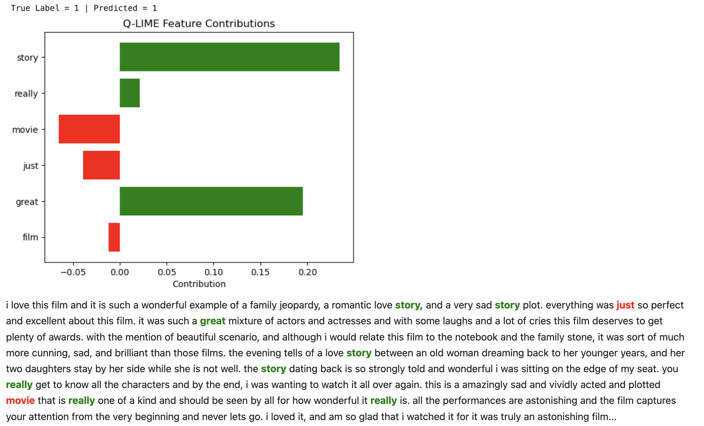

# Q-LIME pi: Quantum LIME for Text Explanations

This repository contains the implementation of **Q-LIME Pi (Quantum LIME)**, a quantum-inspired extension of LIME (Local Interpretable Model-agnostic Explanations), applied to text-based machine learning tasks. Q-LIME leverages quantum-inspired methods to explore the impact of flipping binary features on a model's output more efficiently.

## Features

### 1. Classical and Quantum LIME Comparison
- **Classical LIME**: Perturbs features to evaluate their impact on model predictions using a standard implementation.
- **Q-LIME Pi**: Uses quantum-inspired binary encoding and flipping to compute feature importance.

### 2. Feature Visualization
- Horizontal bar graph visualization for feature contributions.
- Color-coded feature importance visualization directly on the text using HTML in Jupyter Notebooks.

### 3. Performance Evaluation
- Benchmark comparisons between Classical LIME and Q-LIME Pi.
- Metrics include runtime, accuracy, and overlap in top features.

---

## Installation

### Prerequisites
- Python 3.11+
- Libraries:
  - `numpy`
  - `pennylane`
  - `scikit-learn`
  - `matplotlib`
  - `lime`
  - `IPython`

Install the required libraries using:
```bash
pip install numpy pennylane scikit-learn matplotlib lime ipython
```

### Dataset
This project uses the IMDb sentiment analysis dataset. Download the dataset from [IMDb Reviews](https://ai.stanford.edu/~amaas/data/sentiment/) and place it in the `./aclImdb/` directory.

---

## Usage

### Running the Main Script
The `main.py` script acts as the central entry point for the project, allowing users to execute key functionalities through a command-line interface (CLI). Choose from the following tasks:

1. **Run Q-LIME Example Visualization**:
   - Visualizes feature contributions for a single text sample with a horizontal bar graph and highlights top contributing words directly on the text.
   ```bash
   python main.py example
   ```

2. **Run Classical vs Quantum LIME Comparison**:
   - Compares runtime and feature overlap between Classical LIME and Q-LIME Pi.
   ```bash
   python main.py comparison
   ```

3. **Run Benchmark Tests**:
   - Evaluates runtime, accuracy, and feature overlap across multiple configurations.
   ```bash
   python main.py benchmark
   ```

### Script-Specific Functionality

#### `highlighting.py`
Contains the implementation of Q-LIME with:
- Horizontal bar graph visualization of feature contributions.
- Color-coded text highlighting for top features in Jupyter Notebook.

#### `comparison.py`
Compares Classical LIME and Q-LIME:
- Measures runtime and top feature overlap.
- Prints top-5 features for both methods.

#### `benchmark.py`
Benchmarks the performance of Classical LIME and Q-LIME:
- Reports metrics for varying feature dimensions and dataset sizes.

---

## Example Output

### Q-LIME Visualization
**Bar Graph for Feature Contributions** (max_features=15)  


**Text Highlighting**
Highlighted text with top contributing words color-coded (green for positive, red for negative).


### Benchmark Results
**Benchmark Test Output:**

```
=== BENCHMARK RESULTS (Flip Only 1->0) ===
max_feats | Acc  | LIME_time | QLIME_time | Overlap
        5 | 0.450 | 1.126   | 0.005      | 2.50
       10 | 0.580 | 1.130   | 0.010      | 3.10
       15 | 0.600 | 1.079   | 0.075      | 2.90
       20 | 0.610 | 1.464   | 0.807      | 3.40
```

This benchmark demonstrates the trade-offs in runtime and overlap as the feature size increases.

---

## Citation
If you use this repository in your work, please cite as:
```
@article{qlime2024,
  title={Q-LIME Pi: Quantum LIME for Text Explanations},
  author={Your Name},
  year={2024},
  url={https://github.com/nelabdiel/qlime}
}
```

---

## License
This project is licensed under the MIT License. See the `LICENSE` file for details.
